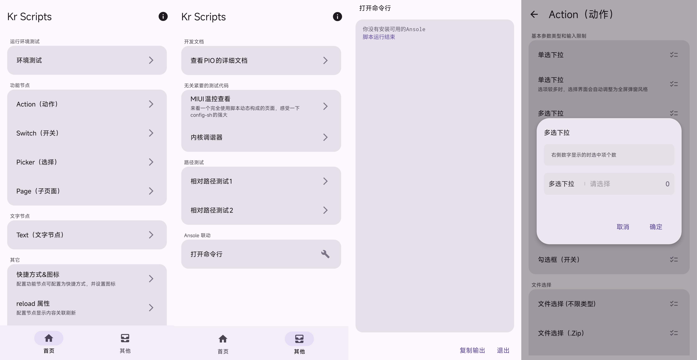

# 简介

## 功能用途
- 利用本框架，通过 `xml + shell` 快速创建具有ROOT权限的玩机工具
- 如果你对`linux shell`脚本语法有一定了解，上手将会非常迅速
- 大多数情况下，只需要修改应用`assets`中的静态文件，即可完成功定义和修改
- 而不需要修改和编译`Java、Kotlin`代码

## 界面展示
- 在开始之前，不妨先看看界面。
- 也可以下载最新的release安装包
- 在你已经ROOT的手机或模拟器上查看效果
- [已发布的 Release版本](https://github.com/buylan01/kr-scripts-next/releases)

